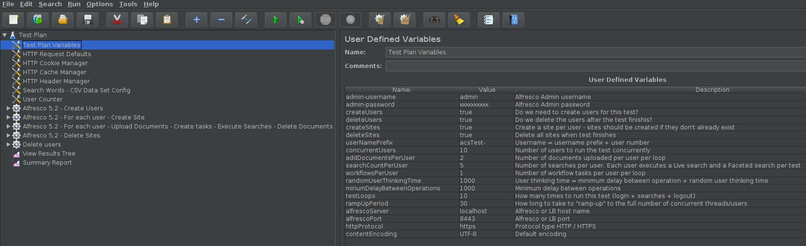
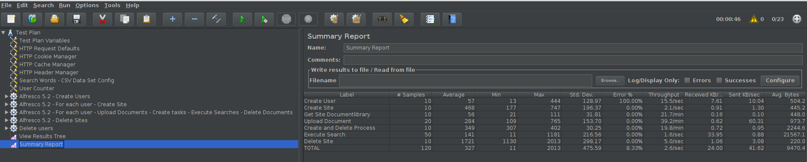

# ACS 6.1.x testing with JMeter 5.2

The Apache JMeter™ application is open source software, a 100% pure Java application designed to load test functional behavior and measure performance.

In this project we show how to run a test with:

  - Multiple concurrent users
  - Ramp-up time
  - User thinking time
  - Different user operations
  - Results reporting

JMeter tests can be executed from JMeter's UI or directly by loading the `ACS_test_scripts/ACS-6-1.jmx` test plan or from the command line. We first need to edit and configured the test plan variables to meet our environment details and test needs.
     

Test Results Summary:

For this test plan we can see the following:

  - We have 10 concurrent users
  - Each user has its own site (created by the test plan)
  - Each user will run 10 test loops
  - Each test loop will navigate to the site, upload and delete content, execute searches, create and delete tasks
  - Upon completion the users, sites and content are deleted automatically

To run the test plan from the command line execute the following command:

        jmeter -n -t ./ACS_test_scripts/ACS-6-1.jmx -l reports/test.jtl -e -o reports

Note: if users are deleted they can not be used again for subsequent tests runs.  Either update the `userNamePrefix` variable to create a new set of test users or set the `deleteUsers` variable to false. The default action is not to delete users so the same test run can be executed multiple times.

This command assumes there is an empty folder called `reports` where the HTML report will get generated.

The test report contains multiple charts showing different stats.

  
